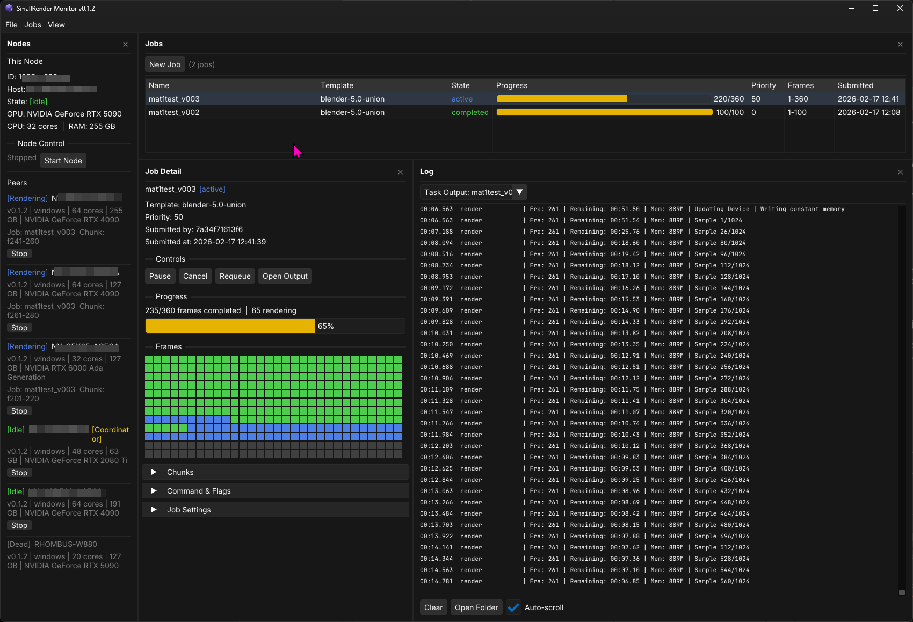

# Small Render

A lightweight render farm coordinator for small VFX teams and freelancers

> [!IMPORTANT]
> Small Render was a short-lived experiment to see whether a render farm could sustain itself solely through communication over a file system. It works and is fine for a couple of nodes, but it is fragile. See its spiritual successor [Mid Render](https://github.com/cbkow/mid-render) for a better setup. 

The idea for Small Render came about with the question: *Could a render farm work without user networking know-how, or reliance on a central database?* 

## The goals:
- A render farm setup that any user can rapidly deploy in a few short steps.
- Will work with average home networks.
- Only using an inbox system on the file system for communication and coordination between nodes--no database needed.
- Providing decent performance for node clusters of 10 or fewer machines.
- Supporting slow file syncing services for the communication layer in the file system. ie. LucidLink, Dropbox, Synology Drive, and Resilio--allowing usage without even a NAS in the middle. However, SMB/LAN will work just as well.
- Using a job-template system that is hackable and all-inclusive--eliminating the need for multiple DCC plugins with bespoke logic and thus maintenance hell. JSON-formatted job templates carry everything you need--from CMD variables for DCCS and regex patterns to read stdout and parse progress. If you can launch a process in CMD, send flags, and read the output, it should work and be relatively easy to set up for additional software.
- Eventually supporting Linux and macOS, but currently Windows only.

## Current State:
- Blender and After Effects renders can be submitted and coordinated across nodes in the Small Render Monitor. 
- Blender and After Effects DCC submission plugins are included.

## Next Steps:
- Cinema 4D Templates
- Houdini Templates
- Then supporting other OSes. 

